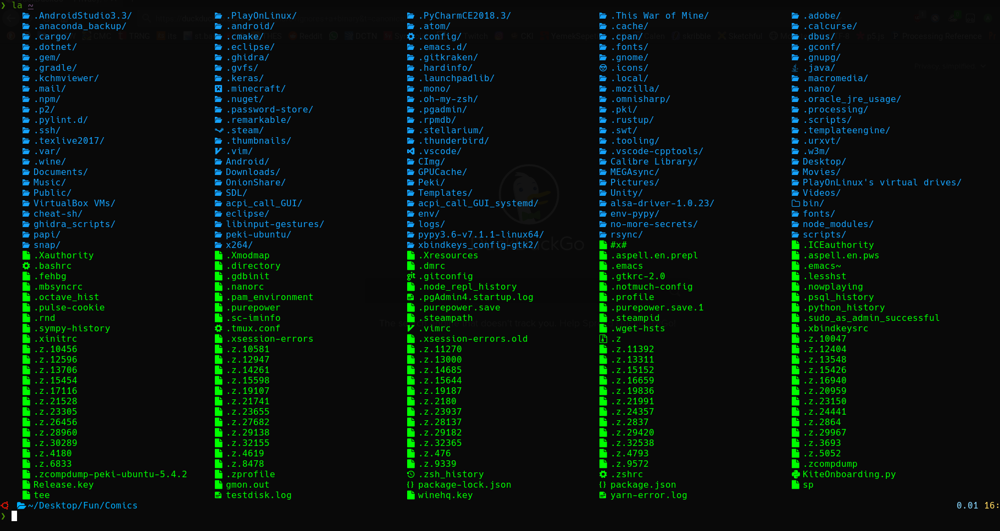
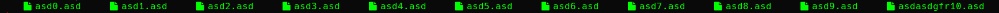
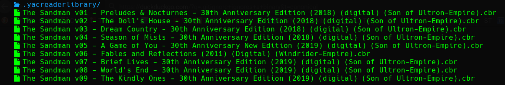

### A Colorful Version of **UNIX Like** systems' *[ls](https://git.savannah.gnu.org/cgit/coreutils.git/tree/src/ls.c)* command, inspired by *[colorls](https://github.com/athityakumar/colorls)* using *[NerdFonts](https://nerdfonts.com/)*

___

##### Requierements
1. _**gcc --version >= 8.0**_
2. **C++17**
3. *Linux* or _MacOS_ (Maybe)

___

##### Installation
**TODO**
- [x] Fix the one row bug
- [ ] Fix Floating Point Exception when `term_width < file_width`
- [ ] Add A Makefile

**Run the following command in the _'list'_ directory**

`g++ -o bin/list src/list.cpp -O3 -std=c++17 -lstdc++fs`
	(Doesn't write to root, so we don't need root privileges)

##### Screenshots

___

___

